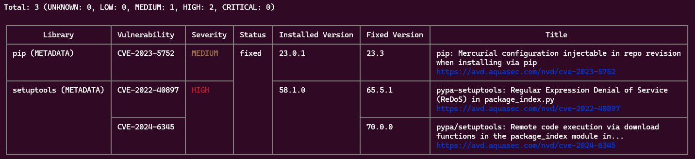

### Практика

#### Настройка безопасности Docker Daemon и сканирование образа

1. Настройте безопасность Docker Daemon:
	- Ограничьте доступ к Docker Daemon:
		- Настройте использование группы docker, чтобы только её участники могли управлять контейнерами.
		- Проверьте права доступа к файлу docker.sock и ограничьте их для безопасности.

*При установке docker на Debian 12 WSL группа docker была создана автоматически, я лишь добавил себя в эту группу:*

```bash
$ sudo usermod -aG docker $USER
```
*Также на хабре нашел статью про remapping и пользователя dockremap:*

>В файле /etc/docker/daemon.json (если его нет, то создайте) укажем параметр >userns-remap:
>```json
>{
>  "userns-remap": "default"
>}
>```
>После установки userns-remap в значение default и перезапуска Docker система автоматически создаст пользователя с именем dockremap. Контейнеры будут запускаться в его контексте, а не от имени пользователя root.

*Выполнять данные операции я не стал, т.к. посчитал необходимым для начала уточнить этот момент у вас.*

2. Сканируйте созданный образ на уязвимости:
	- Выберите созданный вами ранее Docker-образ.
	- Используйте инструмент для сканирования (например, Trivy).
	- Проанализируйте результат сканирования, обратите внимание на уязвимости и примите меры по их устранению.

*Старый Dockerfile:*
```Dockerfile
FROM python:3.9-slim
WORKDIR /app
COPY requirements.txt /app
RUN pip install -r requirements.txt
ENTRYPOINT ["python"]
CMD ["flask_hello.py"]
```

*выдавал ошибки при проверке trivy:*



*Далее выполнена смена базового образа на python:3.14-alpine, также выполнено обновление **RUN apk update && apk upgrade --no-cache**:*

```Dockerfile
FROM python:3.14.0a6-alpine3.21
WORKDIR /app
COPY . /app
RUN apk update && apk upgrade --no-cache
RUN pip install --no-cache-dir -r requirements.txt && \
rm -rf /root/.cache/pip
ENTRYPOINT ["python"]
CMD ["flask_hello.py"]
```
```bash
$ trivy image --ignore-unfixed flask:v2
...
Legend:
- '-': Not scanned
- '0': Clean (no security findings detected)
```

Конечный результат:
- Docker Daemon настроен с учётом базовых мер безопасности.
- Образ просканирован на наличие уязвимостей, и вы получили информацию о возможных рисках.

#### Тестирование

1. Почему важно ограничивать доступ к Docker Daemon?
- [ ] Для уменьшения нагрузки на сеть
- [x] Чтобы предотвратить несанкционированное управление контейнерами
- [ ] Для ускорения работы контейнеров
- [ ] Для снижения объёма занимаемой памяти

2. Какая команда позволяет добавить пользователя в группу Docker?
- [ ] docker adduser    
- [x] sudo usermod -aG docker [имя_пользователя]    
- [ ] docker group add [имя_пользователя]    
- [ ] docker user --add

3. Как можно настроить безопасное соединение для Docker Daemon?    
- [ ] Установить пароль на контейнеры    
- [x] Использовать TLS для шифрования соединений    
- [x] Запретить запуск контейнеров с root-доступом    
- [ ] Включить многофакторную аутентификацию
    
4. Почему не рекомендуется запускать контейнеры с правами root?
- [ ] Это замедляет запуск контейнеров
- [x] Это увеличивает риск атак на хостовую систему    
- [ ] Это ограничивает доступ контейнера к сети    
- [ ] Это препятствует выполнению команд внутри контейнера    

5. Какую инструкцию Dockerfile следует использовать для запуска контейнеров от имени не-root пользователя?
- [x] RUN    
- [ ] USER    
- [ ] CMD    
- [ ] ENTRYPOINT 

6. Что такое подписанные образы в Docker?
- [ ] Образы с установленным паролем для доступа    
- [x] Образы, защищённые от несанкционированного изменения    
- [ ] Образы, включающие данные о пользователе    
- [ ] Образы, доступные только в приватных реестрах  

7. Какая команда включает проверку подписей образов?
- [ ] docker enable dct    
- [x] export DOCKER_CONTENT_TRUST=1    
- [ ] docker secure-sign    
- [ ] docker trust enable     

8. Какой инструмент используется для сканирования образов на наличие уязвимостей?    
- [ ] Kubernetes    
- [x] Trivy    
- [ ] Terraform    
- [ ] Grafana	  

9. Какой тип базового образа рекомендуется для минимизации рисков безопасности?
- [ ] Ubuntu
- [x] Alpine
- [ ] CentOS
- [ ] Debian

10. Что позволяет сделать многоступенчатая сборка (multistage build)?
- [ ] Создать несколько контейнеров одновременно
- [x] Оптимизировать размер образа за счёт разделения этапов сборки
- [ ] Автоматически сканировать образы на уязвимости
- [ ] Сохранить все временные файлы внутри контейнера
