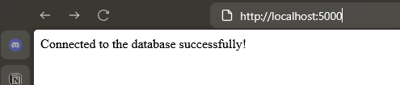

### Практика

#### Создание веб-приложения на Flask и развёртывание через Docker Compose

1. Создайте веб-приложение на Flask:
	- В папке проекта создайте директорию app и внутри неё файл app.py со следующим кодом: 
```python
from flask import Flask
import psycopg2
app = Flask(__name__)
@app.route("/")
def home():
    try:
        conn = psycopg2.connect(
        dbname="mydatabase",
        user="user",
        password="password",
        host="db" 
		)
        conn.close()
        return "Connected to the database successfully!"
    except Exception as e:
        return f"Error: {e}"
if __name__ == "__main__":
    app.run(host="0.0.0.0", port=5000)
```
В той же папке создайте файл requirements.txt:   
		flask
		psycopg2-binary
2. Создайте docker-compose.yml:
 - В корне проекта создайте файл docker-compose.yml для настройки двух сервисов: Flask-приложения и базы данных PostgreSQL.    
 - Укажите параметры подключения к базе данных (POSTGRES_USER, POSTGRES_PASSWORD, POSTGRES_DB).
3. Запустите проект через Docker Compose:
 - Соберите и запустите контейнеры:
		docker-compose up -d
```docker-compose.yml
    version: '3.8'

services:
  web:
    build: .
    ports:
      - "5000:5000"
    depends_on:
      - db
    networks:
      - backend

  db:
    image: postgres:14
    environment:
      POSTGRES_DB: mydatabase
      POSTGRES_USER: user
      POSTGRES_PASSWORD: password
    volumes:
      - postgres_data:/var/lib/postgresql/data
    networks:
      - backend

volumes:
  postgres_data:

networks:
  backend:
    driver: bridge
```

- Убедитесь, что Flask-приложение запущено и слушает на порту 5000.
4. Проверьте работу приложения:
 - Перейдите в браузере по адресу [http://localhost:5000](http://localhost:5000/).    
 - Убедитесь, что приложение подключается к базе данных и отображает сообщение о статусе соединения.



Конечный результат:
- Flask-приложение работает в одном контейнере и успешно взаимодействует с PostgreSQL в другом.
- Данные базы сохраняются между перезапусками благодаря настройке тома.

#### Тестирование

1. Что такое Docker Compose?
- [ ] Инструмент для создания Dockerfile    
- [x] Инструмент для оркестрации многоконтейнерных приложений    
- [ ] Утилита для управления образами Docker    
- [ ] Среда для запуска виртуальных машин
	
2. Какой файл используется для описания конфигурации Docker Compose?
- [ ] docker-compose.conf    
- [ ] docker-config.yml    
- [x] docker-compose.yml    
- [ ] compose-config.yaml
	
3. Какая команда запускает проект, описанный в docker-compose.yml?
- [ ] docker-compose start    
- [ ] docker-compose run    
- [x] docker-compose up    
- [ ] docker-compose deploy  
	
4. Для чего используется секция services в файле docker-compose.yml?
- [ ] Для описания переменных окружения    
- [x] Для определения сервисов (контейнеров) в проекте    
- [ ] Для указания зависимостей проекта    
- [ ] Для настройки сетей
	
5. Какое значение в секции ports обозначает проброс порта 8080 хоста на порт 80 контейнера?
- [ ] "80:8080"    
- [x] "8080:80"    
- [ ] "8080=>80"    
- [ ] "80->8080"    
	
6. Какая директива позволяет указать зависимости между сервисами в Docker Compose?
- [ ] links    
- [ ] volumes    
- [x] depends_on    
- [ ] networks
	
7. Что из перечисленного позволяет сделать секция volumes в docker-compose.yml?
- [ ] Настроить доступ к сети контейнера    
- [x] Хранить данные контейнера независимо от его жизненного цикла    
- [ ] Установить переменные окружения    
- [ ] Указать команды для запуска контейнера    
	
8. Какой файл используется для хранения переменных окружения в Docker Compose?
- [ ] .config    
- [x] .env    
- [ ] variables.yml    
- [ ] compose.env
	
9. Какая команда завершает работу проекта Docker Compose и удаляет ресурсы?    
- [ ] docker-compose stop    
- [ ] docker-compose remove    
- [x] docker-compose down    
- [ ] docker-compose clean    
10. Для чего используется параметр restart: always в docker-compose.yml?
- [ ] Для перезапуска контейнера после завершения команды    
- [x] Для автоматического перезапуска контейнера при его остановке    
- [ ] Для ручного управления перезапуском контейнера    
- [ ] Для настройки зависимости от другого контейнера